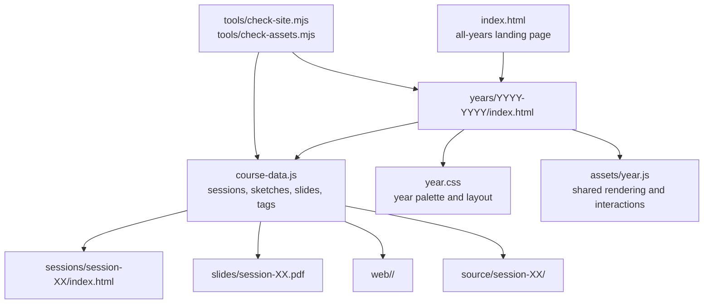

# Repository Architecture

This is a static GitHub Pages course archive. Each academic year is self-contained, while shared rendering and maintenance checks live at the repository root.

## Page Split

- `index.html` keeps page structure and teacher-facing editorial text.
- `course-data.js` is the source of truth for repeated course material: session cards, slide menus, sketch cards, search entries, tags, difficulty, duration, and related sketches.
- `assets/year.js` renders repeated components and handles search, slide switching, smooth anchor movement, accessible active navigation, and lazy sketch previews.
- `year.css` keeps the visual identity for that academic year.

## Maintenance Rule

When adding a session, sketch, or slide, update `course-data.js` first. Then run `npm run check`; it validates links from the generated interface as well as links written directly in HTML.
